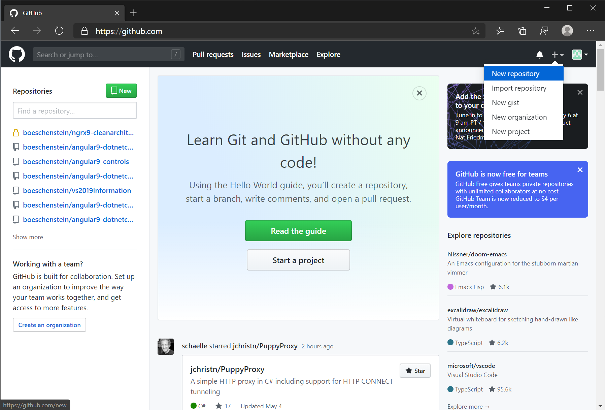

# CCF: Github pages

>Vortrag für CCF (Computer Club Frauenfeld)

Github ist ein Online Speicher für Source Code. Eine Webseite besteht auch aus Source Code.

Eine Webseite besteht u.a. aus HTML Code. Aber keine Angst, wir müssen nicht HTML schreiben. Stattdessen verwenden wir [Markdown](https://guides.github.com/pdfs/markdown-cheatsheet-online.pdf). Dieses Markdown ist eine sehr einfache Sprache und wird automatisch in HTML konvertiert. Doch mehr dazu später.

Wer also Lust hat, innert wenigen Minuten selber ein *statische* Webseite mit Formatierungen, Tabellen und Bildern zu erstellen, kann hier weiter lesen.

>*Statisch* bedeutet, dass wir keine Eingabemaske bauen werden. Solche Daten wären dann dynamische Daten und müssten in einem Speicher für dynamische Daten gespeichert werden (z.B. in einer Datenbank)

## Account erstellen

Als Erstes müsst ihr einen Github Account erstellen: <https://github.com/>

## Anmelden

Nach der erfolgreichen Anmeldung könnt ihr euch einloggen. Das sieht dann etwa so aus. Ich habe aber bereits einige Projekte erstellt, aber bei Euch sieht das etwas anders bzw. leerer aus:

Damit wir nicht zu viel Zeit verlieren, wäre es gut, wenn ihr den Github Login schon vorher erstellen könnt.
Am Sonntag geht's dann hier weiter :)
