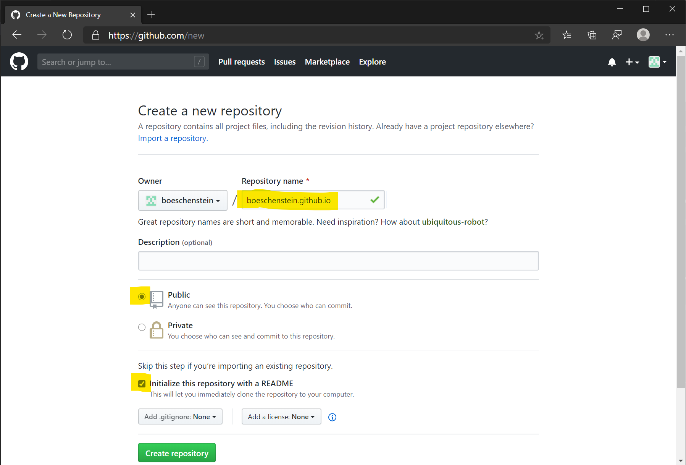
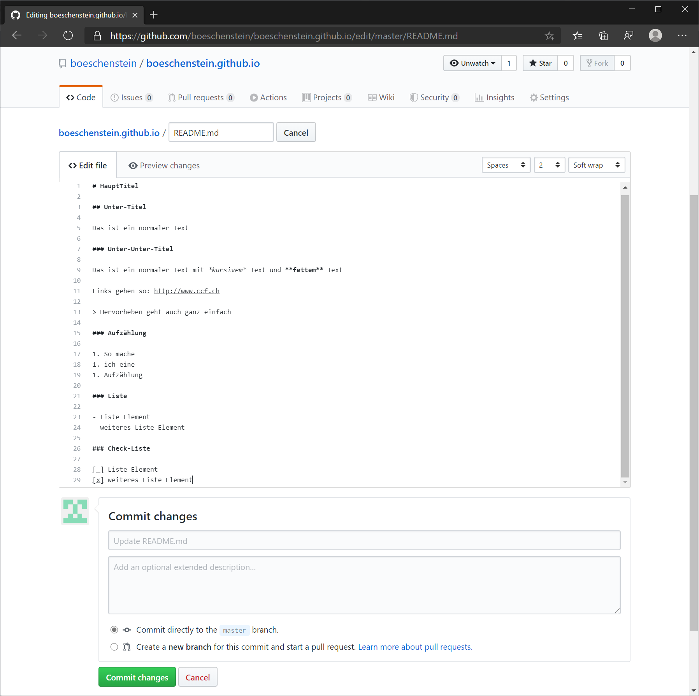
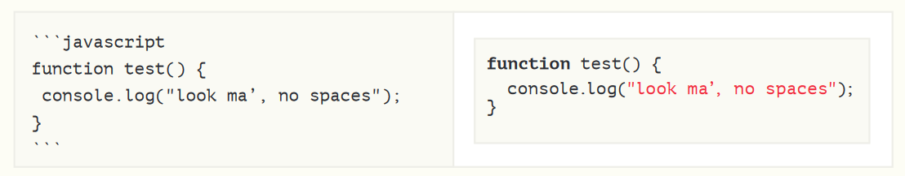

# CCF: Github pages

>Vortrag für CCF (Computer Club Frauenfeld)

Github ist ein kostenloser Online Speicher für Source Code. Eine Webseite besteht auch aus Source Code.

Eine Webseite besteht u.a. aus HTML Code. Aber keine Angst, wir müssen nicht HTML schreiben. Stattdessen verwenden wir [Markdown](https://guides.github.com/pdfs/markdown-cheatsheet-online.pdf). Dieses Markdown ist eine sehr einfache Sprache und wird automatisch in HTML konvertiert. Doch mehr dazu später.

Hier ein paar Beispiele:

- https://clever-geek.github.io/
- https://kmlv.github.io/
- https://stdm.github.io/
- auch wenn man es diesen Seiten nicht ansieht, sie sind trotzdem auf Github gespeichert: https://www.google.com/search?q=site%3A.github.io
- das was ihr hier lest, ich auch eine solche statische Webseite

Wer also Lust hat, innert wenigen Minuten selber ein *statische* Webseite mit Formatierungen, Tabellen und Bildern zu erstellen, kann hier weiter lesen.

>*Statisch* bedeutet, dass wir **keine Eingabemaske** bauen werden. Solche Daten wären dann dynamische Daten und müssten in einem Speicher für dynamische Daten gespeichert werden (z.B. in einer Datenbank)

## Account erstellen

Als Erstes müsst ihr einen Github Account erstellen: <https://github.com/>


## Anmelden

Nach der erfolgreichen Anmeldung könnt ihr euch einloggen. Das sieht dann etwa so aus. Ich habe aber bereits einige Projekte erstellt, aber bei Euch sieht das etwas anders bzw. leerer aus:


Damit wir nicht zu viel Zeit verlieren, wäre es gut, wenn ihr den Github Login schon vorher erstellen könnt.

Falls Ihr einige (2-3) Fotos verwenden wollt, könnt ihr die auch schon bereit legen. (z.B. auf euren Desktop kopieren)

## Repository erstellen

Oben rechts könnt ihr nun auf das + klicken und "New repository" auswählen. (siehe vorheriges Bild)

Folgendes muss gewählt werden:

- Repository Name = `<username>.github.io`
- [x] Public
- [x] Initialize this repository with a README



Repository erstellen mit click auf "Create repository"

## Webseite testen

Nach ein paar Minuten sollte die fast leere Webseite bereits erstellt worden sein: `https://<username>.github.io`

Es steht nur das drauf: `<username>.github.io`

> Bitte melden, wenn das nicht läuft.

**Bravo**, wenn es läuft :) Das Schwierigste ist geschafft, nun könnt ihr die Webseite erweitern.

## Readme bearbeiten

Wenn ihr oben rechts auf das (x) klickt, gibt es etwas mehr Platz.

Die Webseite bearbeitet ihr, wenn ihr bei README.md rechts auf den Stift klickt.


## Markdown bearbeiten

Hier ein paar [Markdown](https://guides.github.com/pdfs/markdown-cheatsheet-online.pdf) Beispiele.



</details>

Die Webseite könnt ihr mit click auf "Commit changes" speichern. Nach ein paar Minuten seht ihr das Resultat auf `https://<username>.github.io` (Browser Refresh oder F5 zum aktualisieren der Webseite)

## Fotos hochladen

Bevor ihr Fotos anzeigen könnt, müsst ihr sie auf den Github Server hochladen.
...

## Tabelle

Wer schafft es, eine Tabelle zu erstellen?

Markdown Anleitung: <https://guides.github.com/pdfs/markdown-cheatsheet-online.pdf>

## Auf/Zuklappen

Wer schafft es, einen Text auf/zuklappbar anzuzeigen?

<details>
  <summary>Hier ein Beispiel</summary>

... hier kommt das hin was ich verstecken möchte ...

</details>

Leider geht das nicht mit Markdown. Aber mit etwas HTML ist das einfach zu lösen:

``` html
<details>
  <summary>Hier ein Beispiel</summary>

... hier kommt das hin was ich verstecken möchte ...

</details>
```

Cool! Markdown versteht auch HTML!

## Emojies

GitHub supports emoji!

Damit ich diese Emojies sehe:

- :+1: :sparkles: :camel: :tada: :rocket: :metal: :octocat:

Muss ich das eingeben:

- `:+1: :sparkles: :camel: :tada: :rocket: :metal: :octocat:`

 Details: <http://www.emoji-cheat-sheet.com>

## Formatieren von Code

Markdown kann Source code formatieren: cmd, c#, css, html, typescript, javascript, markdown, ...


